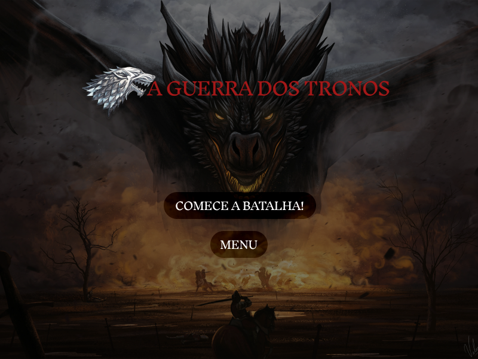
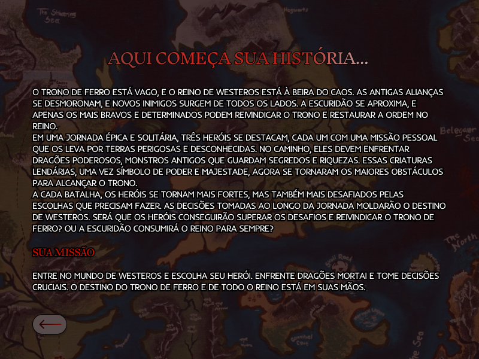
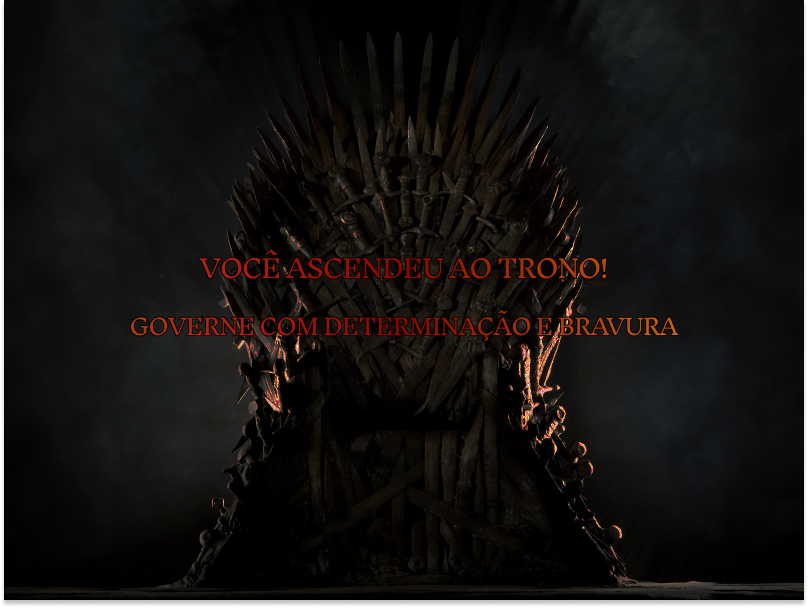

# A Guerra dos Tronos ⚔️🐉

Equipe:

• Ana Sofia <**assm**>

• Byanca Maria <**bms4**>

• Evando Pereira <**epo**>

• Julyana dos Santos <**jsa3**>

• Mariana Beatriz <**mbcf**>

• Thais Fernanda <**tffg**>

## Divisão de tarefas:

|      Equipes      |     Atribuições     |
| ------------------- | ------------------- |
|  **tffg** | Tela Menu e Desing das telas e Assets|
|**assm** e **mbcf** | Mecânica do jogo|
|**jsa3** e  **bms4** |Movimentação dos personagens|
|  **epo** | Fase 1, integração dos Arquivos e Fases, Mecânica do Jogo e Desing dos personagens individuais |
| **tffg**  e **mbcf** | Documentação e Slide |

# History and Evolution

Literary Origins
The story that inspired the game has its roots in George R. R. Martin's "A Song of Ice and Fire" book series. The first book, "A Game of Thrones" (1996), introduced readers to the complex and brutal world of Westeros, where several noble houses fight for power. The plot is rich with political intrigue, epic battles and multifaceted characters.

**Game History**

The Iron Throne is vacant, and the kingdom of Westeros is on the brink of chaos. Old alliances crumble, and new enemies emerge from all sides. Darkness approaches, and only the bravest and most determined can claim the throne and restore order to the kingdom.
In an epic and lonely journey, three heroes stand out, each with a personal mission that takes them through dangerous and unknown lands. Along the way, they must face powerful dragons, ancient monsters that guard secrets and riches. These legendary creatures, once a symbol of power and majesty, have now become the greatest obstacles to achieving the throne.
With each battle, the heroes become stronger, but also more challenged by the choices they need to make. Decisions made along the journey will shape the destiny of Westeros. Will the heroes be able to overcome the challenges and claim the Iron Throne? Or will darkness consume the kingdom forever?

**Your mission**

Enter the world of Westeros and choose your hero. Face deadly dragons and make crucial decisions. The fate of the Iron Throne and the entire realm is in your hands.

## Execution in pycharm

To run the game, follow the steps below:

- Download and install Pycharm.
- Open the files
- Run the main.py file
- Run the individual files for each character
> Note: If the image is not compatible, remember to modify the location of the image file in the code.

## Game Mechanics:

The game is a 2D design with a "Bird-Vision" camera (viewed from above) and a platform gameplay style. The character can move in all directions and perform attacks that vary depending on the chosen character:

• Jon Snow: Fights hand-to-hand with a sword, attacking with the "K" key.

• Daenerys Targaryen: Fires projectiles for ranged combat, staying away from dragons.

• Stannis Baratheon: Uses a shield to reflect dragon shots, focusing on strategic positioning.

• Each character has a specific collectible that improves their skills/attributes, in addition to the points dropped by slain dragons.

## Controls:

Player      |     Keys    |
| ------------------- | ------------------- |
|  **Movement**| &#8592; , &#8593; , &#8594; , &#8595; |
|  **Attack** | K |

## Colecionaveis

|     Equipamento    |     Personagem     | Descrição |
| ------------------- | ------------------- | ------------------- |
|  Jon Snow| True Sword|Item colecionável disponível para Jon Snow, no qual é coletado ao iniciar a batalha.A Espada verdadeira(True Sword) permite que Jon consiga aplicar seu verdadeiro poder e causam maior dano ao golpear os dragões. |
|  Daenerys Targaryen| Orbe de Fogo |Item colecionável disponível para a poderosa Daenerys Targaryen, ao coletar o orbe os pequenos dragões de Daenerys Targaryen atingem seu potencial máximo, disparando mais projéteis e aniquilando seus inimigos.  |
|  Stannis Baratheon|True Shield |item colecionável disponível para o cruel Stannis Baratheon,o True Shield tem a poderosa habilidade de refletir os projéteis disparados pelos dragões, além de conceder a verdadeira defesa absoluta para que nada fique no caminho de Stannis Baratheon até o trono. |
| PyroPoints | Todos|Após a derrota dos dragões, o seu massivo poder é condensado em uma esfera de fogo, o qual o jogador deve coletar para demonstrar como uma forma de troféu pela sua bravura. |

## Bibliotecas e Ferramentas

|     Nome    |     Aplicação     | 
| ------------------- | ------------------- | 
|  Pygame | A biblioteca principal foi essencial para a criação do projeto, pois ofereceu uma vasta gama de comandos e funcionalidades que foram fundamentais para sua execução. |
|  Random| Para otimizar o surgimento dos dragões e melhorar as funcionalidades do código, considere as seguintes abordagens |  
|  Sys | A função está sendo utilizada para encerrar o programa quando necessário, como em casos de derrota do jogador ou ao sofrer danos na classe. Ela garante que o jogo seja finalizado de forma limpa, seja por uma tela de derrota ou por outras condições que exigem o término do jogo.|
| Figma | Ferramenta utilizada para o design e criação de interfaces do projeto e elementos gráficos. |

## Desafios Enfrentados e Aprendizados:

- Utilizar o pygame
- Interação com os coletáveis
- Mecânica de combate
- Criação dos assets do projeto
- Organização e Gestão de Tempo
- Importância do trabalho em Equipe

## Estruturação do Código

Com base no conteúdo abordado durante o período da disciplina, o código foi aprimorado para incorporar comandos e lógicas de programação de maneira eficiente, utilizando comandos condicionais, laços de repetição, funções, tuplas e dicionários. O jogo é iniciado e gerenciado pelo Pygame, que executa as imagens e recursos necessários. A implementação de classes, incluindo Player, Enemy, Collectible e FireballAttack, foi fundamental para estruturar e organizar o código. O loop principal do jogo interliga todos os componentes e garante seu funcionamento, atualizando os sprites através da função update. Além disso, as tuplas são empregadas para controlar as dimensões da tela e dos elementos do jogo, oferecendo uma maneira eficaz de gerenciar as coordenadas e tamanhos no ambiente gráfico. 

## Organização do Código

## Funções e Classes importantes:

 ### Classe - Player():

 - update(): Atualiza a posição do jogador com base nas teclas pressionadas e verifica colisões.
 - attack(): Gerencia a animação de ataque e o dano aos inimigos.
 - shoot(): Dispara projéteis, respeitando o cooldown.
 - draw(): Desenha o jogador na tela.
 - draw_health_bar(): Desenha a barra de vida do jogador.
 - draw_inventory(): Desenha o inventário do jogador. 

### Classe - Weapon():

- __init__(x, y, weapon_type, damage): Inicializa uma instância de arma, definindo o tipo de arma, dano, imagem e posição (x, y).

### Classe - Enemy():

- __init__(image_path, x, y): Inicializa a instância do inimigo (dragão), configurando a imagem, posição, velocidade, vida e atributos de ataque.
- update(): Atualiza a posição do inimigo, movendo-o da direita para a esquerda, e gerencia o ataque (lançando bolas de fogo) com base no cooldown.
- attack(): Cria uma instância de FireballAttack e adiciona aos grupos de sprites de bolas de fogo e todos os sprites.
- draw(screen): Desenha o inimigo na tela na posição atual.
- draw_health_bar(screen): Desenha a barra de vida do inimigo na tela, ajustando o comprimento da barra de acordo com o percentual de vida atual.
- take_damage(damage): Reduz a vida do inimigo com base no dano recebido. Se a vida for menor ou igual a zero, define a vida para zero.

### Classe - Collectible:

- __init__(x, y, item_type): Inicializa a instância de item colecionável, definindo o tipo de item, imagem, posição e tempo de vida.
- update(): Verifica o tempo de vida do item colecionável e o remove se ele ultrapassar o tempo de vida definido.
- draw(screen): Desenha o item colecionável na tela na posição atual.

### Classe - FireballAttack:

- __init__(x, y): Inicializa a instância do ataque de bola de fogo, definindo a imagem, posição e velocidade do projétil.
- update(): Atualiza a posição do projétil, movendo-o da direita para a esquerda, e o remove se sair da tela.
- draw(screen): Desenha o projétil na tela na posição atual.

## Imagens do jogo:

  
  
  
  

## Agradecimento Final:

A equipe agradece ao professores, monitores e todos da UFPE (CIn-UFPE) que fizeram isso ser possivel. Gratidão por todo auxilio, feedback e acompanhamento. Obrigado!!
